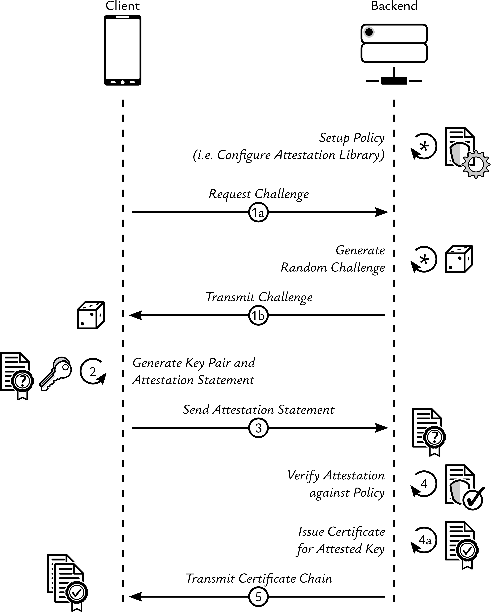

<div align="center">


# Integrated Key and App Attestation Suite

[![A-SIT Plus Official](https://img.shields.io/badge/A--SIT_Plus-official-005b79?logo=data%3Aimage%2Fsvg%2Bxml%3Bbase64%2CPHN2ZyB4bWxucz0iaHR0cDovL3d3dy53My5vcmcvMjAwMC9zdmciIHZpZXdCb3g9IjAgMCAxNDMuNzYyODYgMTg0LjgxOTk5Ij48ZGVmcz48Y2xpcFBhdGggaWQ9ImEiIGNsaXBQYXRoVW5pdHM9InVzZXJTcGFjZU9uVXNlIj48cGF0aCBkPSJNMCA1OTUuMjhoODQxLjg5VjBIMFoiLz48L2NsaXBQYXRoPjwvZGVmcz48ZyBjbGlwLXBhdGg9InVybCgjYSkiIHRyYW5zZm9ybT0ibWF0cml4KDEuMzMzMzMzMyAwIDAgLTEuMzMzMzMzMyAtNDgyLjI1IDUxNy41MykiPjxwYXRoIGZpbGw9IiMwMDViNzkiIGQ9Ik00MTUuNjcgMjQ5LjUzYy03LjE1LjA4LTEzLjk0IDEtMjAuMTcgMi43NWE1Mi4zMyA1Mi4zMyAwIDAgMC0xNy40OCA4LjQ2IDQwLjQzIDQwLjQzIDAgMCAwLTExLjk2IDE0LjU2Yy0yLjY4IDUuNDEtNC4xNCAxMS44NC00LjM1IDE5LjA5bC0uMDIgNi4xMnYyLjE3YS43MS43MSAwIDAgMCAuNy43M2gxNi41MmMuMzkgMCAuNy0uMzIuNzEtLjdsLjAxLTIuMmMwLTIuNi4wMi01LjgyLjAzLTYuMDcuMi00LjYgMS4yNC04LjY2IDMuMDgtMTIuMDZhMjguNTIgMjguNTIgMCAwIDEgOC4yMy05LjU4IDM1LjI1IDM1LjI1IDAgMCAxIDExLjk2LTUuNTggNTUuMzggNTUuMzggMCAwIDEgMTIuNTgtMS43NmM0LjMyLjEgOC42LjcgMTIuNzQgMS44YTM1LjA3IDM1LjA3IDAgMCAxIDExLjk2IDUuNTcgMjguNTQgMjguNTQgMCAwIDEgOC4yNCA5LjU3YzEuOTYgMy42NCAzIDguMDIgMy4xMiAxMy4wMnYyNC4wOUgzNjIuNGEuNy43IDAgMCAwLS43MS43VjMzNWMwIDguNDMuMDEgOC4wNS4wMSA4LjE0LjIgNy4zIDEuNjcgMTMuNzcgNC4zNiAxOS4yMmE0MC40MyA0MC40MyAwIDAgMCAxMS45NiAxNC41N2M1IDMuNzYgMTAuODcgNi42MSAxNy40OCA4LjQ2YTc3LjUgNzcuNSAwIDAgMCAyMC4wMiAyLjc3YzcuMTUtLjA3IDEzLjk0LTEgMjAuMTctMi43NGE1Mi4zIDUyLjMgMCAwIDAgMTcuNDgtOC40NiA0MC40IDQwLjQgMCAwIDAgMTEuOTUtMTQuNTdjMS42Mi0zLjI2IDMuNzctMTAuMDQgMy43Ny0xNC42OCAwLS4zOC0uMTctLjc0LS41NC0uODJsLTE2Ljg5LS40Yy0uMi0uMDQtLjM0LjM0LS4zNC41NCAwIC4yNy0uMDMuNC0uMDYuNi0uNSAyLjgyLTEuMzggNS40LTIuNjEgNy42OWEyOC41MyAyOC41MyAwIDAgMS04LjI0IDkuNTggMzUuMDEgMzUuMDEgMCAwIDEtMTEuOTYgNS41NyA1NS4yNSA1NS4yNSAwIDAgMS0xMi41NyAxLjc3Yy00LjMyLS4xLTguNjEtLjcxLTEyLjc1LTEuOGEzNS4wNSAzNS4wNSAwIDAgMS0xMS45Ni01LjU3IDI4LjUyIDI4LjUyIDAgMCAxLTguMjMtOS41OGMtMS44Ni0zLjQ0LTIuOS03LjU1LTMuMDktMTIuMmwtLjAxLTcuNDdoODkuMTZhLjcuNyAwIDAgMCAuNy0uNzJ2LTM5LjVjLS4xLTcuNjUtMS41OC0xNC40LTQuMzgtMjAuMDZhNDAuNCA0MC40IDAgMCAwLTExLjk1LTE0LjU2IDUyLjM3IDUyLjM3IDAgMCAwLTE3LjQ4LTguNDcgNzcuNTYgNzcuNTYgMCAwIDAtMjAuMDEtMi43N1oiLz48cGF0aCBmaWxsPSIjY2U0OTJlIiBkPSJNNDE5LjM4IDI4MC42M2gtNy41N2EuNy43IDAgMCAwLS43MS43MXYxNS40MmE4LjE3IDguMTcgMCAwIDAtMy43OCA2LjkgOC4yOCA4LjI4IDAgMCAwIDE2LjU0IDAgOC4yOSA4LjI5IDAgMCAwLTMuNzYtNi45di0xNS40MmEuNy43IDAgMCAwLS43Mi0uNzEiLz48L2c%2BPC9zdmc%2B&logoColor=white&labelColor=white)](https://a-sit-plus.github.io)
[](http://www.apache.org/licenses/LICENSE-2.0)
[](http://kotlinlang.org)

[](https://mvnrepository.com/artifact/at.asitplus.warden/verfier)

</div>

_Warden Supreme_ is a fully integrated key and app attestation suite consisting of:
1. Mobile (iOS and Android) client library to generate attestation statements
2. Unified server-side key and app attestation verification library
3. Agnostic communication logic, taking care of process flows and wire format

Put differently, Warden Supreme is the evolution of the battle-tested [WARDEN](https://github.com/a-sit-plus/warden) server-side key and app attestation library,
augmented by Signum's [_Supreme_ KMP crypto provider](https://a-sit-plus.github.io/signum/supreme/) for a consistent UX across Android and iOS.
The original server-side-only key and app attestation library is still available and actively maintained, as it is one
of the pillars supporting Warden Supreme.
It now lives on as [Warden makoto](serverside/makoto) and continues to be published to Maven Central.

## 0. About this Document
This README focuses on the technical aspects and is aimed at informed developers who are familiar with the general concepts, limitations,
and benefits of key and app attestation.

**Warden Supreme's [extensive documentation hub](https://a-sit-plus.github.io/warden-supreme) is a comprehensive one-stop shop covering
all topics regarding key and app attestation.**

It provides an overview of the basic concepts, how to apply them, and
a detailed write-up on how Android and iOS implement them.
The full documentation also lays out a foundation for a risk analysis for anyone
considering attestation as part of a more comprehensive security model.
Finally, it lists all lessons learned from deploying and relying on Warden in production, attesting millions of clients,
including hiccups, glitches, and outright failures due to non-compliant vendor implementations and how to cope with them.

**The remainder of this document assumes familiarity with all the topics covered by the full documentation**, and serves
as a quick-start guide to integrate Warden Supreme to remotely establish trust in mobile clients.

Full API docs are available [here](https://a-sit-plus.github.io/warden-supreme/dokka/).

## 1. Using Warden Supreme in your Projects

Warden Supreme targets Android and iOS clients and JVM-based back-ends.
* On the back-end, add the `verifier` dependency:
  ```kotlin
  implementation("at.asitplus.warden:supreme-verifier:$version")
  ```
* On mobile clients, add the `client` dependency:
  ```kotlin
  implementation("at.asitplus.warden:supreme-client:$version")
  ```

Warden Supreme currently only supports HTTP as its communication protocol and relies on [Ktor](https://ktor.io/) on mobile clients.
The back-end, however, can also use [Spring](https://spring.io/), for example.
An attestation flow works as follows:
1. The client fetches a challenge from the back-end.
2. The client feeds the challenge into hardware-backed key generation to create an attestation statement.
3. The client sends the attestation statement back to the back-end.
    * **Wire-format-wise this is a CSR, with a custom attribute carrying the actual attestation proof**
    * CSRs were chosen as their canonical encoding is precisely specified and because they inherently come with a proof of possession of the private key
    * CSRs freely allow defining arbitrary extensions and attributes, which is a perfect fit for Warden Supreme's usage scenario
    * Finally, the PKIX context is the natural habitat of a CSR
4. The back-end verifies the attestation statement against a predefined policy.
    * If the attestation is considered valid, the back-end issues a certificate for the attested key, thus vouching for the integrity of the client.
    * In case the attestation does not verify, the back-end records the reason for this failure.
5. The back-end responds either with the full certificate chain (success) or a detailed error reason (failure).

Figure&nbsp;1 illustrates this process.

<div align="center">



Figure&nbsp;1: Remotely establishing trust in mobile clients

</div>

As shown in Figure&nbsp;1, the back-end needs to be configured before being able to assert the trustworthiness of a client.
While the actual API is unified for Android and iOS (both for verifying attestation statements and on the mobile clients creating
attestation statements), configuration needs to deal with each platform separately.

### 1.1 Back-End Configuration
Since Android and iOS attestation require different configuration parameters, distinct configuration classes exist.
The following snippet lists all configuration values:

```kotlin
val warden = Warden(
    androidAttestationConfiguration = AndroidAttestationConfiguration(
       applications = listOf(   // REQUIRED: add applications to be attested
           AndroidAttestationConfiguration.AppData(
               packageName = "at.asitplus.attestation_client",
               signatureDigests = listOf("NLl2LE1skNSEMZQMV73nMUJYsmQg7=".encodeToByteArray()),
               appVersion = 5
           ),
           AndroidAttestationConfiguration.AppData( // dedicated app for the latest Android version
               packageName = "at.asitplus.attestation_client-tiramisu",
               signatureDigests = listOf("NLl2LE1skNSEMZQMV73nMUJYsmQg7=".encodeToByteArray()),
               appVersion = 2, // with a different versioning scheme
               androidVersionOverride = 130000, // so we need to override this
               patchLevelOverride = PatchLevel(2023, 6, maxFuturePatchLevelMonths = 2), // also override patch level and
                                                                    // consider patch levels from 2 months in the future
                                                                    // as valid 
                                                                    // maxFuturePatchLevelMonths defaults to 1
                                                                    // null means any future patch level is OK
               trustAnchorOverrides = setOf(extraTrustedRootPubKey) // require a custom root as the trust anchor
                                                                    // for the attestation certificate chain
           )
       ),
       androidVersion = 110000,                  // OPTIONAL, null by default
       patchLevel = PatchLevel(2022, 12),        // OPTIONAL, null by default; maxFuturePatchLevelMonths defaults to 1
       requireStrongBox = false,                 // OPTIONAL, defaults to false
       allowBootloaderUnlock = false,            // OPTIONAL, defaults to false
       requireRollbackResistance = false,        // OPTIONAL, defaults to false
       ignoreLeafValidity = false,               // OPTIONAL, defaults to false
       hardwareAttestationTrustAnchors = linkedSetOf(*DEFAULT_HARDWARE_TRUST_ANCHORS), // OPTIONAL, defaults shown here
       softwareAttestationTrustAnchors = linkedSetOf(*DEFAULT_SOFTWARE_TRUST_ANCHORS), // OPTIONAL, defaults shown here
       verificationSecondsOffset = -300,         // OPTIONAL, defaults to 0
       disableHardwareAttestation = false,       // OPTIONAL, defaults to false; set true to disable HW attestation
       enableNougatAttestation = false,          // OPTIONAL, defaults to false; set true to enable hybrid attestation
       enableSoftwareAttestation = false,        // OPTIONAL, defaults to false; set true to enable SW attestation
       attestationStatementValiditySeconds = 300 // OPTIONAL, defaults to 300s
   ),
   iosAttestationConfiguration = IosAttestationConfiguration(
      applications = listOf(
        IosAttestationConfiguration.AppData(
          teamIdentifier = "9CYHJNG644",
          bundleIdentifier = "at.asitplus.attestation-client",
          iosVersionOverride = "16.0",     // OPTIONAL, null by default
          sandbox = false                  // OPTIONAL, defaults to false
          )
      ),
      iosVersion = 14,                                              // OPTIONAL, null by default
      attestationStatementValiditySeconds = 300                     // OPTIONAL, defaults to 300s
   ),
   clock = FixedTimeClock(Instant.parse("2023-04-13T00:00:00Z")),   // OPTIONAL, system clock by default
   verificationTimeOffset = Duration.ZERO                           // OPTIONAL, defaults to zero
)
```

The (nullable) properties like patch level, iOS version, or Android app version essentially allow for excluding outdated devices.
Defining custom logic to verify the attestation challenge for Android is unsupported by design, considering iOS constraints and inconsistencies between platforms resulting from such a customisation.
More details on the configuration can be found in the API documentation.

#### 1.1.1 A Note on Android Attestation
This library allows combining different flavours of Android attestation, ranging from full hardware attestation
to (rather useless in practice) software-only attestation, which can be useful for testing using an Android emulator.
Hardware attestation is enabled by default, while hybrid and software-only attestation need to be explicitly enabled
through `enableNougatAttestation` and `enableSoftwareAttestation`, respectively. Doing so will chain the corresponding
`AndroidAttestationChecker`s from the strictest (hardware) to the least strict (software-only).
Naturally, hardware attestation can also be disabled by setting `disableHardwareAttestation = true`, although there is probably
no real use case for such a configuration except for testing.

### 1.2 Example Usage
A verifier expects the following parameters to be configured:
1. Either:
    * a preconfigured `Warden` instance, or
    * pass all Warden configuration properties directly
2. an OID (globally unique, usually UUID-based) of the CSR attribute to carry the attestation statement (see Section&nbsp;1, Item&nbsp;3)
3. a lambda specifying how the validity of challenges is verified (and how used challenges are invalidated)

Naturally, clients and back-end need to agree on these parameters. Hence, it makes sense to set them inside
a common module that is shared by back-end and clients. This leads to the following shared constants:

```kotlin
val ENDPOINT_CHALLENGE = "/api/v1/challenge"
val ENDPOINT_ATTEST = "/api/v1/attest"
val PROOF_OID = ObjectIdentifier(Uuid.parse("c893b702-28f6-4c50-8578-d1d7a1580729"))
```

#### 1.2.1 Back-End Setup
In addition to the parameters described above, the back-end also needs a source to generate attestation challenges, track them, and match them against incoming attestation requests.
As Warden Supreme's verifier component aims to integrate with any service, it simply expects a lambda that matches an incoming attestation statement against the expected nonce.
Session management is out of scope, as it is provided by frameworks such as Ktor or Spring.
In the end, a verifier instance is created as follows:

```kotlin
val attestationValidator = AttestationValidator(
    warden, /* the configured instance as per Section 1.1 */
    attestationProofOID = PROOF_OID /* as per Section 1.2 */
) {
    /*
    Your nonce validation logic here:
    Usually, you'll want to check
      * whether the challenge you got is one you issued before
      * and whether it is still fresh enough
    and then remove it from whatever challenge-cache you are using.
    
    Since you receive the challenge in the logic attached to the HTTP endpoint accepting attestation
    statements, you'll be matching it against the active session there anyway.
    */
}
```

As mentioned, it is also possible to pass the configuration parameters laid out in Section&nbsp;1.1 directly.

#### 1.2.2 Handling Requests
As per Section&nbsp;1.2, `ENDPOINT_CHALLENGE` and `ENDPOINT_ATTEST` need to be wired.

##### `ENDPOINT_CHALLENGE`  expected to return an `AttestationChallenge`
The encoding of the challenge is not fixed, but can be serialized using `kotlinx.serialization`

`AttestationChallenge`, contains:
1. `nonce: ByteArray`: The actual challenge value; usually a cryptographic nonce, based on true randomness
2. `validity: Duration`: This is used to communicate the validity duration of a challenge to the client
3. `timeZone: TimeZone`: Optional information about the TimeZone set on the backend
4. `postEndpoint: String`: This property conveys the endpoint to post the attestation statement to. This will typically be `<service url>/$ENDPOINT_ATTEST`.
5. `timeOffset: Duration`: This property is used to inform the client about the maximum tolerated time offset for temporal validations.

A fresh challenge is prepared as follows:

```kotlin
val challenge= attestationValidator.issueChallenge(
    TODO("Your nonce obtaining code here"),
    TODO("Your Challenge validity duration here"), //optional
    timeZone = TimeZone.currentSystemDefault(), //optional
    ENDPOINT_ATTEST,
    timeOffset = TODO("Communicate your server-side clock offset here"), //optional
)
```

##### `ENDPOINT_ATTEST` expects a CSR created by the Supreme Client, after it obtained a challenge from `ENDPOINT_CHALLENGE`

Hence, the back-end is expected to decode the received body into a CSR, verify the contained attestation statement and
(if everything checks out) issue a binding certificate and respond with the full certificate chain. When using Ktor,
this typically works as follows:

```kotlin
post(ENDPOINT_ATTEST) {
    val src = call.receive<ByteArray>()
    val resp =
        attestationValidator.verifyKeyAttestation(Pkcs10CertificationRequest.decodeFromDer(src)) { csr ->
        
        /* certificateSigner is assumed to be a `Signer` instance configured to use the CA key for signing */
        certificateSigner.sign(
            TbsCertificate(
                serialNumber = YOUR_SERIAL_HERE,
                publicKey = csr.publicKey, // use the CSR's subject public key
                signatureAlgorithm = certificateSigner.signatureAlgorithm.toX509SignatureAlgorithm().getOrThrow(),
                validFrom = Asn1Time(Clock.System.now()),
                validUntil = Asn1Time(Clock.System.now() + CERT_VALIDITY),
                issuerName = YOUR_ISSUER_NAME_HERE,
                subjectName = YOUR_SUBJECT_NAME_HERE,
            )
        ).map { listOf(it) }
    }
        
    call.respondText(Json.encodeToString(resp), contentType = ContentType.Application.Json)
}
```

#### 1.2.3 Client Integration

On the client, Warden Supreme is even easier to integrate, assuming you are using
Signum's [_Supreme_ KMP crypto provider](https://a-sit-plus.github.io/signum/supreme/):

```kotlin
// Create a Supreme attestation client
val client = AttestationClient(HttpClient())

// Fetch a challenge
val challenge = client.getChallenge(Url(ENDPOINT_CHALLENGE)).getOrThrow()

// Init the signer with a freshly created key and produce an attestation statement
val signer = PlatformSigningProvider.createSigningKey(alias) {
    ec {}
    hardware {
        attestation {
            this.challenge = challenge.nonce
        }
    }
}.getOrThrow()

// Create and sign a CSR
val csr = signer.createCsr(challenge).getOrThrow()

// Have the back-end attest it
val result = client.attest(csr, challenge.postEndpoint)

// Get the certificate chain containing the binding certificate as leaf
val certificateChain = when (result) {
    is AttestationResponse.Failure -> TODO()
    is AttestationResponse.Success -> result.certificateChain
}
```

Again, more details can be found in **Warden Supreme's [full documentation](https://a-sit-plus.github.io/warden)**.

### 1.3 Reacting to Attestation Results
The Supreme attestation verifier only returns an enum indicating the reason for an error, with the option to attach a custom explanatory string.
This is by design, as it is generally undesirable to expose the internals of a back-end to clients.

On the back-end, however, attestation issues typically need to be analysed. Hence, the Supreme attestation validator provides
three callbacks to analyse attestation errors and success (without side effects).
1. `onPreAttestationError` is called in case of operational/internal errors, or if the attestation statement cannot
   be extracted from a CSR, for example.
2. `onAttestationError` is called if the attestation statement fails to verify. This includes an invalid bootloader lock state, wrong package identifier, etc.
3. `onAttestationSuccess` is called right before an `AttestationResponse.Success` is returned with the fully parsed and verified attestation statement and the associated public key.
   This can be useful for statistical analyses, for example.

## 2. Debugging, Recording, and Replaying Attestation Checks
Whenever the actual attestation check fails (i.e., whenever `onAttestationError()` is called), a ready-made `WardenDebugAttestationStatement` is created and passed to this function.
Hence, two pieces of information are available to aid debugging:

1. the attestation error (as the receiver of this lambda)
2. the debug statement, which can be exported for off-site analyses

### 2.1 Debugging Integrated Attestation

The `WardenDebugAttestationStatement` can be serialized to JSON by invoking `.serialize()` (or `serializeCompact()`) on it.
It can later be deserialized by calling `deserialize()` (or `deserializeCompact()`) on its companion.
By finally calling `replaySmart()` on such a deserialized debug info object, the whole attestation verification process is replayed.

Attaching a debugger allows for step-by-step debugging of any attestation errors encountered.
For the most straightforward debugging experience:
* import this project into IDEA
* add a breakpoint [here in line 19](utils/makoto-diag/src/main/kotlin/Diag.kt#L19)
* and run it in debug mode.

Just be sure to add a single argument pointing to a file as described in [Diag.kt](utils/makoto-diag/src/main/kotlin/Diag.kt)!

### 2.2 Debugging Raw Android Attestations
A similar utility exists for printing the contents of an Android attestation statement, located in [/utils/roboto-diag](utils/roboto-diag).
More specifically, it pretty-prints the contents of the leaf certificate's Android attestation extension and expects either
* `-f path/to/leaf/certificate.pem`
* a base64-encoded certificate as the sole argument

It will then serialize a certificate to JSON, giving insight into the attestable properties.

## 3. Project Structure
This project is structured into four groups:
1. `/supreme` contains the _Supreme_ integrated key and app attestation suite, building upon group&nbsp;2.
2. `/serverside` contains the server-side foundations with all the low-level logic to verify attestations
3. `/utils` contains unpublished utility helpers aimed at aiding attestation errors. Those are to be used inside an IDE with a debugger attached to it
4. `/dependencies` contains external dependencies that are not published to Maven Central or anywhere else and are thus compiled into group&nbsp;2 or used for testing.

### 3.1 `/supreme`

| Name                                                                                                                                                                                                                                                                                                                              | Info                                                                                                                                      |
|-----------------------------------------------------------------------------------------------------------------------------------------------------------------------------------------------------------------------------------------------------------------------------------------------------------------------------------|-------------------------------------------------------------------------------------------------------------------------------------------|
|  <picture>  <source media="(prefers-color-scheme: dark)" srcset="docs/docs/assets/images/verifier-w.png">  <source media="(prefers-color-scheme: light)" srcset="docs/docs/assets/images/verifier-b.png">   </picture> | Supreme verifier to be integrated into back-ends that want to remotely establish trust in mobile clients through key and app attestation. |
| <picture>  <source media="(prefers-color-scheme: dark)" srcset="docs/docs/assets/images/client-w.png">  <source media="(prefers-color-scheme: light)" srcset="docs/docs/assets/images/client-b.png">   </picture>           | Supreme client to be integrated into mobile apps that need to prove their integrity and trustworthiness towards back-end services.        |
| <picture>  <source media="(prefers-color-scheme: dark)" srcset="docs/docs/assets/images/common-w.png">  <source media="(prefers-color-scheme: light)" srcset="docs/docs/assets/images/common-b.png">   </picture>           | Commons containing shared client and verifier logic, data classes, etc.                                                                   |

### 3.2 `/serverside`

The modules located here can be used on their own, in case the Supreme integrated attestation suite is not desired.

|                                                | <picture>  <source media="(prefers-color-scheme: dark)" srcset="docs/docs/assets/images/makoto-w.png">  <source media="(prefers-color-scheme: light)" srcset="docs/docs/assets/images/makoto-b.png">   </picture> | 
|---------------------------------------------------------------------------------------------------------------------------------------------------|------------------------------------------------------------------------------------------------------------------------------------------------------------------------------------------------------------------------------------------------------------------------------------------------------------------------------------|
| Android-only server-side key and app attestation library developed by A-SIT Plus. Used to be a separate project, now integrated here as a module. | Unified server-side Android and iOS key and app attestation library providing a common API to remotely establish trust in Android and iOS devices. Depends on Warden roboto and [Vincent Haupert's](https://github.com/veehaitch) excellent [DeviceCheck/AppAttest](https://github.com/veehaitch/devicecheck-appattest) library.   |
| Location: `/serverside/roboto`                                                                                                                    | Location: `/serverside/makoto`                                                                                                                                                                                                                                                                                                     |
| Maven coordinates: `at.asitplus.warden:roboto`                                                                                                    | Maven coordinates: `at.asitplus.warden:makoto`                                                                                                                                                                                                                                                                                     |

### 3.3 `/utils`
This group houses the debugging/examination utils mentioned in Section&nbsp;2.

### 3.4 `/dependencies`
Teams at Google released reference Android attestation parsers (not full attestation checkers to remotely establish trust in Android devices!) and PKIX certificate path validators to complement parsing.
They did not, however, publish those artifacts to Maven Central. Hence, Warden Supreme integrates them as git submodules and compiles them into _Warden roboto_.

In addition, an HTTP proxy is present to facilitate testing. It is not, however, shipped with any artifact.

## Contributing
External contributions are greatly appreciated!
Just be sure to observe the contribution guidelines (see [CONTRIBUTING.md](CONTRIBUTING.md)).

---
<p align="center">
This project has received funding from the European Union’s Horizon 2020 research and innovation
programme under grant agreement No 959072.
</p>
<p align="center">

</p>

<p align="center">
The Apache License does not apply to the logos (including the A-SIT logo) and the project/module name(s), as these are the sole property of
A-SIT/A-SIT Plus GmbH and may not be used in derivative works without explicit permission!
</p>
