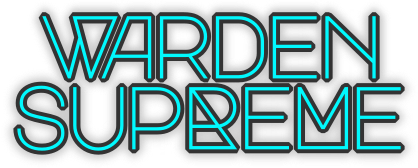
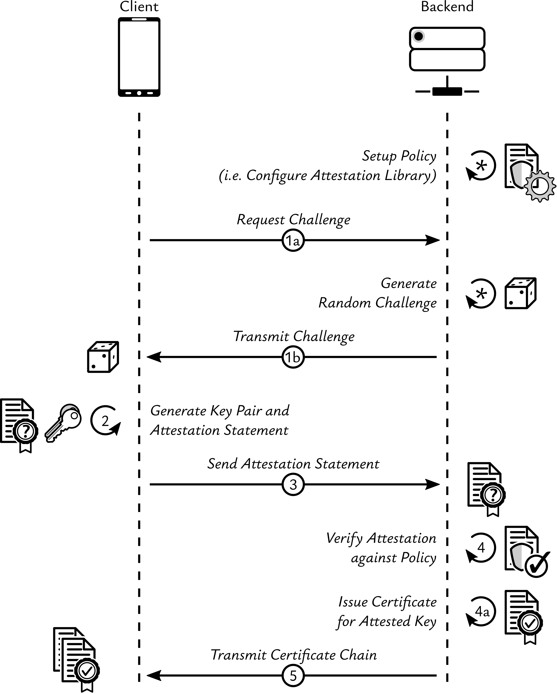

<div align="center">



# Integrated Key and App Attestation Suite

[![A-SIT Plus Official](https://img.shields.io/badge/A--SIT_Plus-official-005b79?logo=data%3Aimage%2Fsvg%2Bxml%3Bbase64%2CPHN2ZyB4bWxucz0iaHR0cDovL3d3dy53My5vcmcvMjAwMC9zdmciIHZpZXdCb3g9IjAgMCAxNDMuNzYyODYgMTg0LjgxOTk5Ij48ZGVmcz48Y2xpcFBhdGggaWQ9ImEiIGNsaXBQYXRoVW5pdHM9InVzZXJTcGFjZU9uVXNlIj48cGF0aCBkPSJNMCA1OTUuMjhoODQxLjg5VjBIMFoiLz48L2NsaXBQYXRoPjwvZGVmcz48ZyBjbGlwLXBhdGg9InVybCgjYSkiIHRyYW5zZm9ybT0ibWF0cml4KDEuMzMzMzMzMyAwIDAgLTEuMzMzMzMzMyAtNDgyLjI1IDUxNy41MykiPjxwYXRoIGZpbGw9IiMwMDViNzkiIGQ9Ik00MTUuNjcgMjQ5LjUzYy03LjE1LjA4LTEzLjk0IDEtMjAuMTcgMi43NWE1Mi4zMyA1Mi4zMyAwIDAgMC0xNy40OCA4LjQ2IDQwLjQzIDQwLjQzIDAgMCAwLTExLjk2IDE0LjU2Yy0yLjY4IDUuNDEtNC4xNCAxMS44NC00LjM1IDE5LjA5bC0uMDIgNi4xMnYyLjE3YS43MS43MSAwIDAgMCAuNy43M2gxNi41MmMuMzkgMCAuNy0uMzIuNzEtLjdsLjAxLTIuMmMwLTIuNi4wMi01LjgyLjAzLTYuMDcuMi00LjYgMS4yNC04LjY2IDMuMDgtMTIuMDZhMjguNTIgMjguNTIgMCAwIDEgOC4yMy05LjU4IDM1LjI1IDM1LjI1IDAgMCAxIDExLjk2LTUuNTggNTUuMzggNTUuMzggMCAwIDEgMTIuNTgtMS43NmM0LjMyLjEgOC42LjcgMTIuNzQgMS44YTM1LjA3IDM1LjA3IDAgMCAxIDExLjk2IDUuNTcgMjguNTQgMjguNTQgMCAwIDEgOC4yNCA5LjU3YzEuOTYgMy42NCAzIDguMDIgMy4xMiAxMy4wMnYyNC4wOUgzNjIuNGEuNy43IDAgMCAwLS43MS43VjMzNWMwIDguNDMuMDEgOC4wNS4wMSA4LjE0LjIgNy4zIDEuNjcgMTMuNzcgNC4zNiAxOS4yMmE0MC40MyA0MC40MyAwIDAgMCAxMS45NiAxNC41N2M1IDMuNzYgMTAuODcgNi42MSAxNy40OCA4LjQ2YTc3LjUgNzcuNSAwIDAgMCAyMC4wMiAyLjc3YzcuMTUtLjA3IDEzLjk0LTEgMjAuMTctMi43NGE1Mi4zIDUyLjMgMCAwIDAgMTcuNDgtOC40NiA0MC40IDQwLjQgMCAwIDAgMTEuOTUtMTQuNTdjMS42Mi0zLjI2IDMuNzctMTAuMDQgMy43Ny0xNC42OCAwLS4zOC0uMTctLjc0LS41NC0uODJsLTE2Ljg5LS40Yy0uMi0uMDQtLjM0LjM0LS4zNC41NCAwIC4yNy0uMDMuNC0uMDYuNi0uNSAyLjgyLTEuMzggNS40LTIuNjEgNy42OWEyOC41MyAyOC41MyAwIDAgMS04LjI0IDkuNTggMzUuMDEgMzUuMDEgMCAwIDEtMTEuOTYgNS41NyA1NS4yNSA1NS4yNSAwIDAgMS0xMi41NyAxLjc3Yy00LjMyLS4xLTguNjEtLjcxLTEyLjc1LTEuOGEzNS4wNSAzNS4wNSAwIDAgMS0xMS45Ni01LjU3IDI4LjUyIDI4LjUyIDAgMCAxLTguMjMtOS41OGMtMS44Ni0zLjQ0LTIuOS03LjU1LTMuMDktMTIuMmwtLjAxLTcuNDdoODkuMTZhLjcuNyAwIDAgMCAuNy0uNzJ2LTM5LjVjLS4xLTcuNjUtMS41OC0xNC40LTQuMzgtMjAuMDZhNDAuNCA0MC40IDAgMCAwLTExLjk1LTE0LjU2IDUyLjM3IDUyLjM3IDAgMCAwLTE3LjQ4LTguNDcgNzcuNTYgNzcuNTYgMCAwIDAtMjAuMDEtMi43N1oiLz48cGF0aCBmaWxsPSIjY2U0OTJlIiBkPSJNNDE5LjM4IDI4MC42M2gtNy41N2EuNy43IDAgMCAwLS43MS43MXYxNS40MmE4LjE3IDguMTcgMCAwIDAtMy43OCA2LjkgOC4yOCA4LjI4IDAgMCAwIDE2LjU0IDAgOC4yOSA4LjI5IDAgMCAwLTMuNzYtNi45di0xNS40MmEuNy43IDAgMCAwLS43Mi0uNzEiLz48L2c%2BPC9zdmc%2B&logoColor=white&labelColor=white)](https://a-sit-plus.github.io)
[](http://www.apache.org/licenses/LICENSE-2.0)
[](http://kotlinlang.org)

[](https://mvnrepository.com/artifact/at.asitplus.warden/)

</div>

> [!TIP]
> Need help tailored to your needs? See our [💎 Services](https://a-sit-plus.github.io/warden-supreme/services/).

_Warden Supreme_ is a fully integrated key and app attestation suite consisting of:

1. A mobile (iOS and Android) client library to generate attestation statements
2. A unified server-side key and app attestation verification library
3. Agnostic communication logic that handles process flows and wire format

Put differently, Warden Supreme is the evolution of the battle-tested [WARDEN](https://github.com/a-sit-plus/warden) server-side key and app attestation library,
augmented by Signum's [_Supreme_ KMP crypto provider](https://a-sit-plus.github.io/signum/supreme/) for a consistent UX across Android and iOS.

The original server-side-only key and app attestation library is still available and actively maintained, as it is one
of the pillars supporting Warden Supreme. It now lives on as [Warden makoto](serverside/makoto) and continues to be
published to Maven Central.

> [!WARNING]
> **Warden Supreme changed some defaults compared to previous WARDEN / WARDEN-roboto**
>
> Most prominently, there is no Nougat hybrid attestation any more and trust anchor management was completely revamped.  
> Do check out the [full migration guide](https://a-sit-plus.github.io/warden-supreme/integration/migration/).
>
> **Ignoring these changes can result in a total security failure if you do not ensure freshness by feeding random cryptographic nonces into attestation statement creation and properly checking them.**

## 0. About this Document

This README provides only a brief overview. **Warden Supreme's [extensive documentation hub](https://a-sit-plus.github.io/warden-supreme) is a comprehensive one-stop shop covering
all topics regarding key and app attestation.**

The documentation hub explains the basic concepts, how to apply them, and provides
a detailed write-up on how Android and iOS implement them.
The full documentation also lays out a foundation for risk analysis for anyone
considering attestation as part of a more comprehensive security model.
Finally, it lists lessons learned from deploying and relying on Warden in production, attesting millions of clients,
including hiccups, glitches, and outright failures due to non-compliant vendor implementations—and how to cope with them.

**The remainder of this document assumes familiarity with all topics covered by the full documentation**, and serves
as a quick-start guide to integrate Warden Supreme to remotely establish trust in mobile clients.

Full API docs are available [here](https://a-sit-plus.github.io/warden-supreme/dokka/).

## 1. Using Warden Supreme in your Projects

Warden Supreme targets Android and iOS clients and JVM-based back-ends.

* On the back-end, add the `verifier` dependency:
  ```kotlin
  implementation("at.asitplus.warden:supreme-verifier:$version")
  ```
* On mobile clients, add the `client` dependency:
  ```kotlin
  implementation("at.asitplus.warden:supreme-client:$version")
  ```

> [!TIP]
> Check out **Warden Supreme's [integration guide](https://a-sit-plus.github.io/warden-supreme/integration/supreme)** for a step-by-step
> integration tutorial and a minimum working example. The guide includes code samples and minimum and exhaustive configuration examples.

Warden Supreme currently supports only HTTP as its communication protocol and relies on [Ktor](https://ktor.io/) on mobile clients.
The back-end, however, can also use [Spring](https://spring.io/), for example.

An attestation flow works as follows:

1. The client fetches a challenge from the back-end.
2. The client feeds the challenge into hardware-backed key generation to create an attestation statement.
3. The client sends the attestation statement back to the back-end.
    * **Wire-format-wise, this is a CSR with a custom attribute carrying the actual attestation proof.**
    * CSRs were chosen because their canonical encoding is precisely specified and because they inherently include a proof of possession of the private key.
    * CSRs freely allow defining arbitrary extensions and attributes, which is a perfect fit for Warden Supreme's usage scenario.
    * Finally, the PKIX context is the natural habitat of a CSR.
4. The back-end verifies the attestation statement against a predefined policy.
    * If the attestation is considered valid, the back-end issues a certificate for the attested key, thus vouching for the integrity of the client.
    * If the attestation does not verify, the back-end records the reason for the failure.
5. The back-end responds either with the full certificate chain (success) or a detailed error reason (failure).

Figure&nbsp;1 illustrates this process.

<div align="center">



Figure&nbsp;1: Remotely establishing trust in mobile clients

</div>

As shown in Figure&nbsp;1, the back-end needs to be configured before it can assert a client’s trustworthiness.
While the API is unified across Android and iOS (for both attestation statement creation on clients and verification on the server),
configuration must still handle each platform separately.

## 2. Debugging, Recording, and Replaying Attestation Checks

Whenever the attestation check fails (i.e., whenever `onAttestationError()` is called), a ready-made
`WardenDebugAttestationStatement` is created and passed to this function.

This gives you two inputs to aid debugging:

1. the attestation error (as the receiver of this lambda)
2. the debug statement, which can be exported for off-site analyses

### 2.1 Debugging Integrated Attestation

`WardenDebugAttestationStatement` can be serialized to JSON by invoking `.serialize()` (or `serializeCompact()`) on it.
It can later be deserialized by calling `deserialize()` (or `deserializeCompact()`) on its companion.
Finally, call `replay()` on the deserialized debug object to replay the full attestation verification process.

Attaching a debugger allows step-by-step inspection of any attestation errors encountered.
For the most straightforward debugging experience:

* import this project into IDEA
* add a breakpoint [here in line 19](utils/makoto-diag/src/main/kotlin/Diag.kt#L19)
* run it in debug mode

Be sure to add a single argument pointing to a file as described in [Diag.kt](utils/makoto-diag/src/main/kotlin/Diag.kt).

### 2.2 Debugging Raw Android Attestations

A similar utility exists for printing the contents of an Android attestation statement, located in [/utils/roboto-diag](utils/roboto-diag).
More specifically, it pretty-prints the contents of the leaf certificate's Android attestation extension and expects either:

* `-f path/to/leaf/certificate.pem`
* a base64-encoded certificate as the sole argument

It then serializes a certificate to JSON, giving insight into the attestable properties.

## 3. Project Structure

This project is structured into four groups:

1. `/supreme` contains the _Supreme_ integrated key and app attestation suite, building upon group&nbsp;2
2. `/serverside` contains the server-side foundations with all low-level logic to verify attestations
3. `/utils` contains unpublished utilities for investigating attestation errors; these are intended to be used inside an IDE with a debugger attached
4. `/dependencies` contains external dependencies that are not published to Maven Central (or anywhere else) and are thus compiled into group&nbsp;2 or used for testing

### 3.1 `/supreme`

| Name                                                                                                                                                                                                                                                                                                                              | Info                                                                                                                                      |
|-----------------------------------------------------------------------------------------------------------------------------------------------------------------------------------------------------------------------------------------------------------------------------------------------------------------------------------|-------------------------------------------------------------------------------------------------------------------------------------------|
|  <picture>  <source media="(prefers-color-scheme: dark)" srcset="docs/docs/assets/images/verifier-w.png">  <source media="(prefers-color-scheme: light)" srcset="docs/docs/assets/images/verifier-b.png">   </picture> | Supreme verifier to be integrated into back-ends that want to remotely establish trust in mobile clients through key and app attestation. |
| <picture>  <source media="(prefers-color-scheme: dark)" srcset="docs/docs/assets/images/client-w.png">  <source media="(prefers-color-scheme: light)" srcset="docs/docs/assets/images/client-b.png">   </picture>           | Supreme client to be integrated into mobile apps that need to prove their integrity and trustworthiness towards back-end services.        |
| <picture>  <source media="(prefers-color-scheme: dark)" srcset="docs/docs/assets/images/common-w.png">  <source media="(prefers-color-scheme: light)" srcset="docs/docs/assets/images/common-b.png">   </picture>           | Commons containing shared client and verifier logic, data classes, etc.                                                                   |

### 3.2 `/serverside`

The modules located here can be used on their own, in case the Supreme integrated attestation suite is not desired.

|                                                | <picture>  <source media="(prefers-color-scheme: dark)" srcset="docs/docs/assets/images/makoto-w.png">  <source media="(prefers-color-scheme: light)" srcset="docs/docs/assets/images/makoto-b.png">   </picture> |
|---------------------------------------------------------------------------------------------------------------------------------------------------|-------------------------------------------------------------------------------------------------------------------------------------------------------------------------------------------------------------------------------------------------------------------------------------------------------------------------------------|
| Android-only server-side key and app attestation library developed by A-SIT Plus. Used to be a separate project, now integrated here as a module. | Unified server-side Android and iOS key and app attestation library providing a common API to remotely establish trust in Android and iOS devices. Depends on Warden roboto and [Vincent Haupert's](https://github.com/veehaitch) excellent [DeviceCheck/AppAttest](https://github.com/veehaitch/devicecheck-appattest) library. |
| Location: `/serverside/roboto`                                                                                                                    | Location: `/serverside/makoto`                                                                                                                                                                                                                                                                                                      |
| Maven coordinates: `at.asitplus.warden:roboto`                                                                                                     | Maven coordinates: `at.asitplus.warden:makoto`                                                                                                                                                                                                                                                                                      |

### 3.3 `/utils`

This group houses the debugging/examination utilities mentioned in Section&nbsp;2.

### 3.4 `/dependencies`

Teams at Google released reference Android attestation parsers (not full attestation checkers to remotely establish trust in Android devices) and PKIX certificate path validators to complement parsing.
They did not, however, publish these artifacts to Maven Central. Hence, Warden Supreme integrates them as git submodules and compiles them into _Warden roboto_.

In addition, an HTTP proxy is included to facilitate testing. It is not, however, shipped with any artifact.

## Contributing

External contributions are greatly appreciated.
Please observe the contribution guidelines (see [CONTRIBUTING.md](CONTRIBUTING.md)).

---
<p align="center">
This project has received funding from the European Union’s Horizon 2020 research and innovation
programme under grant agreement No 959072.
</p>
<p align="center">

</p>

<p align="center">
The Apache License does not apply to the logos (including the A-SIT logo) and the project/module name(s), as these are the sole property of
A-SIT/A-SIT Plus GmbH and may not be used in derivative works without explicit permission!
</p>
