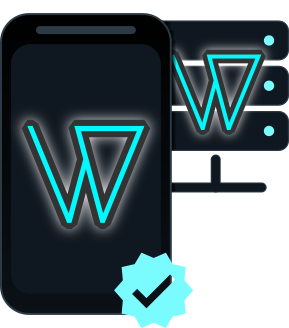

<link rel="stylesheet" href="stylesheets/landing.css">






{{ icon(icon_name, label) }}{{ label }}




  {{ icon(icon_name, label) }}
  {{ label }}





  

    
{{ icon(icon_name, title) }}

    <h3>{{ title }}</h3>
  

  
{{ body }}





  {{ icon(icon_name) }}
  
{{ body }}





  

    
{{ step }}

    <h3>{{ title }}</h3>
  

  
{{ body }}





  

    
{{ icon(icon_name, title) }}

    <h3>{{ title }}</h3>
  

  
{{ body }}

  <a class="ws-link" href="{{ href1 }}">{{ link1 }}</a>
  <a class="ws-link" href="{{ href2 }}">{{ link2 }}</a>





  

    
{{ icon(icon_name, title) }}

    <h3>{{ title }}</h3>
  

  
{{ body }}

  <a class="ws-link" href="{{ href1 }}">{{ link1 }}</a>
  <a class="ws-link" href="{{ href2 }}">{{ link2 }}</a>



<h1></h1>

      

 <h2>End-to-End Integrated Attestation for Android and iOS – Unified, Production-Ready.</h2>

              {{ badge('android', 'Android') }}
              {{ badge('apple', 'iOS') }}
              {{ badge('file-certificate', 'Policy-driven') }}
              {{ badge('shield-star', 'Battle-tested') }}
              {{ badge('code-tags', 'Open-Source') }}
            

        

          

            

              Let your sevice verify app and device integrity using platform attestation.
              Warden Supreme hides all complexity behind a single, unified API across your stack. 
              Define a policy, plug in the verifier, certify hardware‑backed keys. 

            

              <a class="md-button md-button--primary ws-cta" href="integration/supreme/">Get started</a>
              <a class="md-button ws-cta" href="overview/">Read the Docs</a>
              <a class="md-button ws-cta" href="services/">Services</a>
            

            

              {{ icon('chart-line', 'Proof') }}
              
Millions of devices attested in production – and counting.

            

          

          

            

              

               
            

        

      

    

  <section class="ws-section">
    

      <h2>Why Warden Supreme?</h2>
      

        {{ feature_card('security', 'Unified Verification', 'One verifier for Android Key Attestation and Apple App Attest.') }}
        {{ feature_card('layers', 'One Consistent API', 'Shared APIs across server, Android and iOS clients.') }}
        {{ feature_card('file-certificate', 'Policy-Driven Checks', 'Define and evolve verification policies without client rewrites.') }}
        {{ feature_card('speedometer', 'Get Going, Fast', 'Client integration in five lines of code – no cheap tricks, no sleight of hand.') }}
        {{ feature_card('check-decagram', 'Production-Proven', 'Built on the battle-tested WARDEN stack, now consolidated and refined.') }}
        {{ feature_card('shield-alert', 'Risk-Based', 'Grounded in threat modelling and platform characteristics – privacy-first.') }}
      

    

  </section>

  <section class="ws-section ws-steps">
    

      <h2>How It Works</h2>
      

        {{ step_card('1', 'Define Policy', 'Specify what "trusted" means in your environment. Your policy, your rules.') }}
        {{ step_card('2', 'Plug in Verifier', 'Add two HTTPS endpoints to your service and connect the verifier.') }}
        {{ step_card('3', 'Integrate into Apps', 'Five lines of code is all it takes.') }}
        {{ step_card('4', 'Issue Certificates', 'Create hardware‑backed keys and certify them based on your policy.') }}
      

    

  </section>

  <section class="ws-section" id="docs-hub">
    

      <h2>Explore the Docs</h2>
      

        {{ doc_card('book-open-page-variant', 'Background', 'Attestation primer, threat models, platform specifics, and privacy.', 'Start here', 'bg/primer/') }}
        {{ doc_card('cogs', 'Technical Deep Dive', 'Android attestation, iOS App Attest, and platform quirks.', 'Android', 'technical/android/', 'iOS', 'technical/ios/') }}
        {{ doc_card('rocket-launch', 'Integration', 'End-to-end implementation guide, config, and data model.', 'Get started', 'integration/supreme/') }}
        {{ doc_card('book-alphabet', 'Glossary', 'Terminology and definitions across all things attestation.', 'Browse glossary', 'glossary/') }}
      

    

  </section>

  <section class="ws-section ws-funding">
    

      

        This project has received funding from the European Union's Horizon 2020 research and innovation
        programme under grant agreement No 959072.
      

      

        
      

    

  </section>

