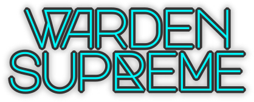

{ .img-center }

# Your One‑Stop Shop for Mobile Client Attestation { .img-center }

[![A-SIT Plus Official](https://img.shields.io/badge/A--SIT_Plus-official-005b79?logo=data%3Aimage%2Fsvg%2Bxml%3Bbase64%2CPHN2ZyB4bWxucz0iaHR0cDovL3d3dy53My5vcmcvMjAwMC9zdmciIHZpZXdCb3g9IjAgMCAxNDMuNzYyODYgMTg0LjgxOTk5Ij48ZGVmcz48Y2xpcFBhdGggaWQ9ImEiIGNsaXBQYXRoVW5pdHM9InVzZXJTcGFjZU9uVXNlIj48cGF0aCBkPSJNMCA1OTUuMjhoODQxLjg5VjBIMFoiLz48L2NsaXBQYXRoPjwvZGVmcz48ZyBjbGlwLXBhdGg9InVybCgjYSkiIHRyYW5zZm9ybT0ibWF0cml4KDEuMzMzMzMzMyAwIDAgLTEuMzMzMzMzMyAtNDgyLjI1IDUxNy41MykiPjxwYXRoIGZpbGw9IiMwMDViNzkiIGQ9Ik00MTUuNjcgMjQ5LjUzYy03LjE1LjA4LTEzLjk0IDEtMjAuMTcgMi43NWE1Mi4zMyA1Mi4zMyAwIDAgMC0xNy40OCA4LjQ2IDQwLjQzIDQwLjQzIDAgMCAwLTExLjk2IDE0LjU2Yy0yLjY4IDUuNDEtNC4xNCAxMS44NC00LjM1IDE5LjA5bC0uMDIgNi4xMnYyLjE3YS43MS43MSAwIDAgMCAuNy43M2gxNi41MmMuMzkgMCAuNy0uMzIuNzEtLjdsLjAxLTIuMmMwLTIuNi4wMi01LjgyLjAzLTYuMDcuMi00LjYgMS4yNC04LjY2IDMuMDgtMTIuMDZhMjguNTIgMjguNTIgMCAwIDEgOC4yMy05LjU4IDM1LjI1IDM1LjI1IDAgMCAxIDExLjk2LTUuNTggNTUuMzggNTUuMzggMCAwIDEgMTIuNTgtMS43NmM0LjMyLjEgOC42LjcgMTIuNzQgMS44YTM1LjA3IDM1LjA3IDAgMCAxIDExLjk2IDUuNTcgMjguNTQgMjguNTQgMCAwIDEgOC4yNCA5LjU3YzEuOTYgMy42NCAzIDguMDIgMy4xMiAxMy4wMnYyNC4wOUgzNjIuNGEuNy43IDAgMCAwLS43MS43VjMzNWMwIDguNDMuMDEgOC4wNS4wMSA4LjE0LjIgNy4zIDEuNjcgMTMuNzcgNC4zNiAxOS4yMmE0MC40MyA0MC40MyAwIDAgMCAxMS45NiAxNC41N2M1IDMuNzYgMTAuODcgNi42MSAxNy40OCA4LjQ2YTc3LjUgNzcuNSAwIDAgMCAyMC4wMiAyLjc3YzcuMTUtLjA3IDEzLjk0LTEgMjAuMTctMi43NGE1Mi4zIDUyLjMgMCAwIDAgMTcuNDgtOC40NiA0MC40IDQwLjQgMCAwIDAgMTEuOTUtMTQuNTdjMS42Mi0zLjI2IDMuNzctMTAuMDQgMy43Ny0xNC42OCAwLS4zOC0uMTctLjc0LS41NC0uODJsLTE2Ljg5LS40Yy0uMi0uMDQtLjM0LjM0LS4zNC41NCAwIC4yNy0uMDMuNC0uMDYuNi0uNSAyLjgyLTEuMzggNS40LTIuNjEgNy42OWEyOC41MyAyOC41MyAwIDAgMS04LjI0IDkuNTggMzUuMDEgMzUuMDEgMCAwIDEtMTEuOTYgNS41NyA1NS4yNSA1NS4yNSAwIDAgMS0xMi41NyAxLjc3Yy00LjMyLS4xLTguNjEtLjcxLTEyLjc1LTEuOGEzNS4wNSAzNS4wNSAwIDAgMS0xMS45Ni01LjU3IDI4LjUyIDI4LjUyIDAgMCAxLTguMjMtOS41OGMtMS44Ni0zLjQ0LTIuOS03LjU1LTMuMDktMTIuMmwtLjAxLTcuNDdoODkuMTZhLjcuNyAwIDAgMCAuNy0uNzJ2LTM5LjVjLS4xLTcuNjUtMS41OC0xNC40LTQuMzgtMjAuMDZhNDAuNCA0MC40IDAgMCAwLTExLjk1LTE0LjU2IDUyLjM3IDUyLjM3IDAgMCAwLTE3LjQ4LTguNDcgNzcuNTYgNzcuNTYgMCAwIDAtMjAuMDEtMi43N1oiLz48cGF0aCBmaWxsPSIjY2U0OTJlIiBkPSJNNDE5LjM4IDI4MC42M2gtNy41N2EuNy43IDAgMCAwLS43MS43MXYxNS40MmE4LjE3IDguMTcgMCAwIDAtMy43OCA2LjkgOC4yOCA4LjI4IDAgMCAwIDE2LjU0IDAgOC4yOSA4LjI5IDAgMCAwLTMuNzYtNi45di0xNS40MmEuNy43IDAgMCAwLS43Mi0uNzEiLz48L2c%2BPC9zdmc%2B&logoColor=white&labelColor=white){ .img-center }](https://a-sit-plus.github.io) 

Warden Supreme is a comprehensive solution for remote attestation on mobile platforms.
It provides a unified framework to verify the integrity of Android and iOS client applications and the devices the are running on,
ensuring that only authentic, untampered apps can access a service. This project consolidates
[WARDEN](https://github.com/a-sit-plus/warden) and [WARDEN‑roboto](https://github.com/a-sit-plus/warden-roboto),
integrating them with [Signum](https://a-sit-plus.github.io/signum/), a Kotlin Multiplatform crypto/PKI library,
to deliver a streamlined attestation format and developer experience.

!!! tip
    Already familiar with attestation? **[Jump to the Integration Guide](integration/supreme.md)**.

This documentation goes beyond Warden Supreme specifics and provides a structured overview of remote attestation,
from concepts to hands‑on integration:

* **Background**
    * What is Remote Attestation? A security mechanism where a device proves its integrity to a remote server by producing a signed statement about its hardware, OS state, and app identity.  
      → See [Remote Attestation Primer](bg/primer.md).
    * Why attestation beats heuristics (e.g., simple “root checks”), plus threat models and risks.  
      → See [Threat Models and Risks](bg/threatmodels.md).
    * “Pure” Attestation vs. proprietary services (Google Play Integrity, Apple App Attest), privacy, data protection, and digital sovereignty.  
      → See [Privacy and Data Protection](bg/privacy.md).

* **Technical Details**
    * Android key attestation: proving hardware‑backed keys and embedding app identity in the attestation record.  
      → See [Technical Deep Dive: Android](technical/android.md).
    * iOS App Attest: verifying app integrity and emulating key attestation semantics.  
      → See [Technical Deep Dive: iOS](technical/ios.md).
    * Pitfalls, quirks, and workarounds requiring careful evaluation.  
      → See [Technical Deep Dive: Quirks and Hints](technical/quirks.md).

* **Integrating Warden Supreme**  
  Warden Supreme includes the battle‑tested, formerly stand‑alone WARDEN library that has attested millions of devices in production.
  Using Warden Supreme reduces integration pitfalls and complexity, enabling you to:
    - ✅ Verify device and app integrity using hardware‑backed proofs
    - ✅ Support Android Key Attestation (see [Android Key & ID Attestation](https://source.android.com/docs/security/features/keystore/attestation))
    - ✅ Support Apple App Attest (see [DeviceCheck / App Attest](https://developer.apple.com/documentation/devicecheck)) with key attestation emulation
    - ✅ Use a unified server API for both platforms
    - ✅ Use a unified client API for both platforms

→ See the [Integration Guide](integration/supreme.md).
  
* **Glossary**  
  A comprehensive glossary covering terminology across the attestation domain.  
  → See the [Glossary](glossary.md).

!!! info "Help Wanted"
    This living document aims to be an authoritative resource on attestation.
    If something is incorrect or missing, please [file an issue](https://github.com/a-sit-plus/warden-supreme/issues/new).

---

This project has received funding from the European Union’s Horizon 2020 research and innovation
programme under grant agreement No 959072.

